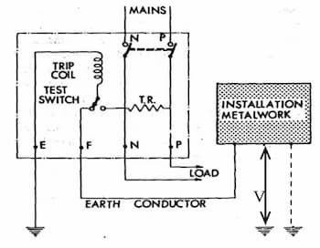

Short for Earth Leakage Current Breaker. Detects earth leakage.

Current through the body, not voltage, is what harms people. Because of that
[RCCB](/s1/electrical-fundamentals/electrical-installation/rccb)s are preferred
instead of ELCBs.

### Mechanism

Has a trip coil. Trips when voltage difference between the frame earth and the
reference earth exceeds the rated voltage (usually $40\,\text{V}$). The trip
coil is energized by the voltage difference, and the spring-loaded contact is
released which breaks the circuit and cuts off power. Up to about $50\,\text{V}$
has been traditionally considered as a safe voltage.

2 earth terminals are required for the proper operation.

- Frame earth  
  To which all non-conducting metallic parts of equipment are connected
- Reference earth
