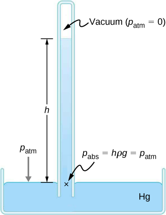
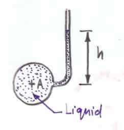
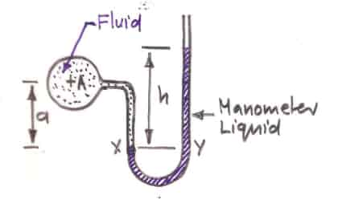
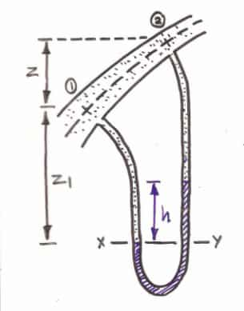

## Barometer

## Piezometer

Open-ended tube connected to a vessel / pipe containing a liquid.

Measures the pressure head of a liquid.

Simple. Small pressure differences can be measured with it. Only
works for liquids. A long tube is required to measure even moderate
pressures.

## Manometer

Hydrostatic principle is used here. Measures absolute pressure. Manometer liquid
should not mix with the liquid in which the pressure is to be measured.

$$
P_x = P_y
$$

$$
P_{A} + a\rho g = P_{\text{atm}} + h \rho_{m} g
$$

$$
P_{A} = P_{\text{atm}} + h \rho_{m}g - a\rho g
$$

### Differential Manometer

Used to measure pressure difference between two points. Can be used for both
liquids and gases. Difficult to measure small pressure differences (because
small displacement of manometer liquid).

## Pressure Gauges

### Bourdon Pressure Gauge

Easy to use. A wide range of pressures can be measured with it. Not very accurate. Needs to be calibrated regularly.
