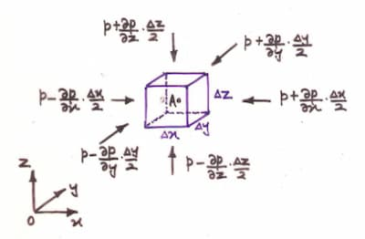

import HydrostaticPressureFluidElement from "./images/hydrostatic-pressure-fluid-element.svg";

At a point,

$$
P = \lim_{\delta A \to 0} \frac{\delta F}{\delta A}
$$

## Pascal's law

The hydrostatic pressure at a point is the same from all directions.

### Proof

Consider the fluid element shown, containing the point $A$.

<HydrostaticPressureFluidElement />

From the image:
$\sin{\theta}=\frac{\Delta{z}}{\Delta{s}}\;\land\;\cos{\theta}=\frac{\Delta{x}}{\Delta{s}}$

For equilibrium:

$$
P_x(\Delta{y}\Delta{z})-P_s(\Delta{y}\Delta{s})\sin{\theta}=0
\implies
P_x=P_s
$$

$$
P_z(\Delta{x}\Delta{y})-P_s(\Delta{y}\Delta{s})\cos{\theta}-\frac{1}{2}\Delta{x}\Delta{y}\Delta{z}\rho g=0
\implies
P_z=P_s+\frac{1}{2}\Delta{z}\rho g
$$

As all $\Delta{x},\Delta{y},\Delta{z}$ approaches $0$: $P_z=P_s$. Therefore
$P_x=P_z=P_s$

## Variation along directions

### Proof

Let $p$ be the pressure at the point $A\equiv (x,y,z)$.

$$
p = f(x,y,z)
$$

$$
dp =
\frac{\partial p}{\partial x} \text{d}x
+
\frac{\partial p}{\partial y} \text{d}y
+
\frac{\partial p}{\partial z} \text{d}z
$$

By considering equilibrium of this fluid element containing $A$.

In the $x$ direction,

$$
\bigg(
	p -
	\frac{\partial p}{\partial x} \frac{\Delta{x}}{2}
\bigg)
\Delta{y}
\Delta{z}
-
\bigg(
	p +
	\frac{\partial p}{\partial x} \frac{\Delta{x}}{2}
\bigg)
\Delta{y}
\Delta{z}
= 0
$$

$$
\frac{\partial p}{\partial x} = 0
$$

Similarly $ \frac{\partial p}{\partial y} = 0 $ can be proven.

In the $z$ direction,

$$
\bigg(
	p -
	\frac{\partial p}{\partial z} \frac{\Delta{z}}{2}
\bigg)
\Delta{x}
\Delta{y}
-
\bigg(
	p +
	\frac{\partial p}{\partial z} \frac{\Delta{z}}{2}
\bigg)
\Delta{x}
\Delta{y}
-
\Delta{x}
\Delta{y}
\Delta{z}
\rho
g
= 0
$$

$$
\frac{\partial p}{\partial z} = -\rho g
$$

$$
dp = -\rho g\,\text{d}z
$$

$$
p = -\int{\rho g\,\text{d}z}
$$

<Note title="For incompressible fluids">

$\rho$ is constant.

$$
p = -\rho g\int{\text{d}z} = -\rho gz + c = f(z)
$$

</Note>

## Isobar

Surface of constant pressure.

## Types of pressure

### Atmospheric Pressure

Pressure exerted by atmospheric air.

### Gauge Pressure

Measured in respect to atmospheric pressure.

### Absolute Pressure

Measured in respect to perfect vaccum.

$$
\text{Absolute Pressure} = \text{Atmospheric Pressure} + \text{Guage Pressure}
$$

### Piezometric pressure

$$
P = -\rho gz + c
$$

$$
P + \rho gz = c = P^{*}
$$

## Pressure diagram

A diagram showing the variation of pressure along a submerged surface.

## Pressure Head

Height of a particular fluid column that will produce the pressure at a point.

$$
\text{Pressure head} = h = \frac{p}{\gamma}
$$

## Pressure difference between 2 points

Suppose there are 2 points $\text{A},\text{B}$ with a height difference of $h$.

$ P_1 = -\rho gz_1 + c $

$ P_2 = -\rho gz_2 + c $

$ P_2 - P_1 = -\rho g(z_2 - z_1) = -\rho g (-h) = h \rho g $

$ P_2 = P_1 + h \rho g $
