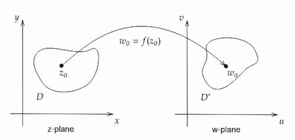

Suppose $w=f(z)$ where $z,w \in \mathbb{C}$. Input and output points are marked
in 2 separate complex planes.



Here:

- $D$ - domain of $f$
- $D'$ - codomain of $f$

### Image

Image of $f$ is the set: $ $

```math
\big\{
f(z)\;|\;z\in D
\big\}
```

## Cartesian form

$$
f(z) = u(x,y) + iv(x,y)
$$

Here $u, v$ are real functions. $ $
