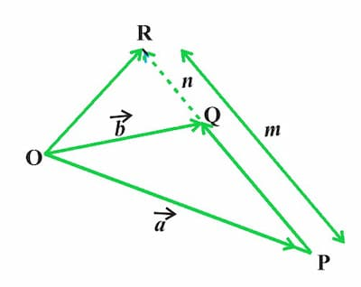

Suppose $\text{R}$ divides the line segment $\text{PQ}$ in the ratio $m:n$ (both
are positive and $m \ge n$), the division can either be internal or external.

## Internally

$$
\overrightarrow{\text{OR}} = \frac{m\overrightarrow{\text{OQ}}+n\overrightarrow{\text{OP}}}{m+n}
$$

## Externally

$$
\overrightarrow{\text{OR}} = \frac{m\overrightarrow{\text{OQ}}-n\overrightarrow{\text{OP}}}{m-n}
$$
