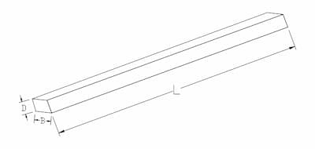
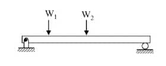
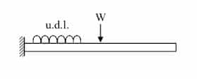
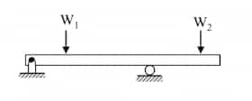
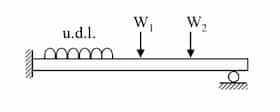
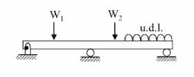
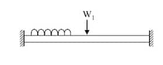
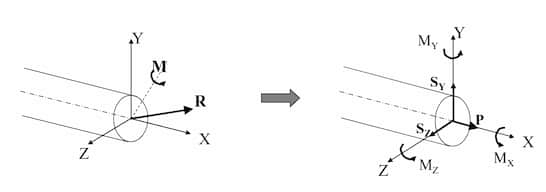

- long ($L >> B,D$)
- axis of the beam is straight
- constant cross-section throughout its length

## Classified by Supporting Conditions

First 3 are the mandatory ones in s1.

u.d.l means uniformly distributed load.

| Type                      | Image                                                                | Notes                           |
| ------------------------- | -------------------------------------------------------------------- | ------------------------------- |
| Simply supported beam     |          | **At ends**: Max SF and BM = 0  |
| Cantilevered beam         |                  | **At fixed end**: Max SF and BM |
| Overhanging beam          |                    |                                 |
| Propped cantilevered beam |  |                                 |
| Continuous beam           |                      |                                 |
| Fixed beam                |                                | **At ends**: Max SF and BM      |

## At a Section

- $ P $ - Normal force / Axial force
- $ S_y, S_y $ - Shear forces along $y$ and $z$ axis
- $ M_x $ - Twisting moment / Torque
- $ M_y, M_z $ - Bending moments about $y$ and $z$ axis

## Degress of Freedom

A plane member have 3 degrees of freedom. Any of the 3 can be restrained.

- Displacement in $x$-direction
- Displacement in $y$-direction
- Rotation about $z$-direction

## SFD & BMD

### Sign Convention

- Bending moment
  - Hogging (curves upwards in the middle) is **(+) ve**
  - Sagging (curves downwards in the middle) is **(-) ve**
- Shear force
  - Clockwise shear is **(+) ve**.
  - Counterclockwise shear is **(-) ve**.

### Pure Bending

A member is in pure bending when shear force is $0$ and bending moment is a
constant.

### Point of Contraflexure

The point about which bending moment is $0$, and changes its sign through the
point.

## Distributed Load

Suppose a beam is under a distributed load of $w=f(x)$ per unit length.

$$
\frac{\text{d}S}{\text{d}x}=-w
$$

$$
\frac{\text{d}M}{\text{d}x}=-S
\;\;
\land
\;\;
\frac{\text{d}^2M}{\text{d}x^2}=w
$$

## Deflection of a Beam

Suppose a simply supported beam is applied a load of $W$ at mid-span.

$$
S_{\text{max}} = \frac{WL}{4I}
\;\;
\land
\;\;
D_{\text{max}} = \frac{WL^3}{48EI}
$$

Here:

- $S_\text{max}$ - Maximum stress
- $D_\text{max}$ - Deflection
- $W$ - Load
- $L$ - Span length
- $E$ - Young's modulus
- $I$ - Second moment of cross-sectional area

## Principle of Superposition

A beam with multiple loads can be split into multiple systems each with a single
load. Reason for doing so is the ease of calculations.

Values will be the sum of each system's corresponding value.
