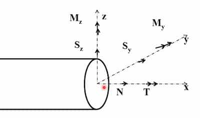

3 types:

- Bars (1D) - Only covered in s1
- Plates and Shells (2D)
- Blocks (3D)

## Pin Joint

Doesn't exert a moment. Free rotations are allowed. When only pin joints are
used, bars will have only axial forces.

## Bars

Here

- $N$ - Axial force
- $S_x,S_y$ - Shear force
- $M_x$

### Types of bars

#### Axially loaded

Load causes tension or compression predominantly.

- Predomniant tension - Ties
- Predomniant compression - Struts

#### Flexural

Load causes bending predominantly. Example: beams.

#### Torsional

Load causes torque predominantly. Example: Shafts.
