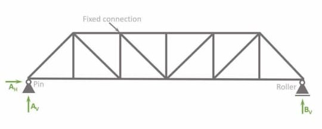
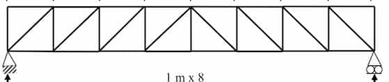

## Pratt type

Internal force in web members are tensile.

## Howe type

Internal force in web members are compressive.

## Comparison

- Pratt type is cost efficient compared to Howe type
- Howe type requires short and thick web members to be strong as Pratt type
