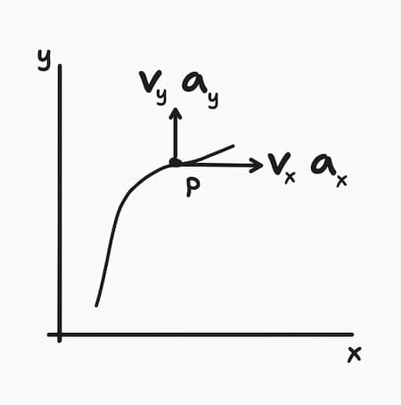
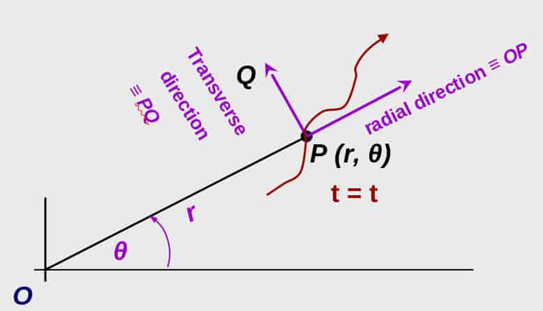
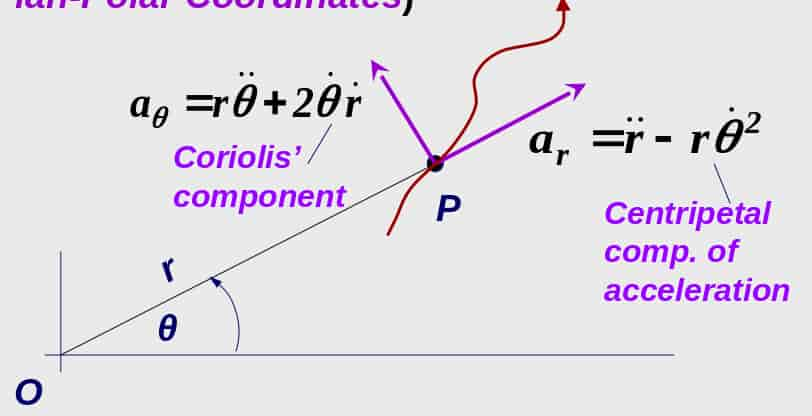

A branch of mechanics, which deals with motion of bodies.

2 parts:

- Kinematics  
  The study of geometric aspects of motion (not referencing the forces)
- Kinetics  
  The analysis of the forces that cause the motion

## Kinematics of a Particle

A particle has a mass and negligible size.

<Note>

When bodies of finite size is of interest, the body might be considered as
particles **provided** motion of the body is characterized by motion of its
center of mass and any rotation of the body is neglected.

</Note>

### Rectilinear Motion

When the motion of a particle is along a straight line.

Suppose $x$ is the distance to the particle from a fixed point on its motion
path.

- $\dot{x}$ is its instantaneous velocity.
- $\ddot{x}$ is its instantaneous acceleration.

### Curvilinear Motion

When the motion of a particle is along a curve.

Suppose $\overline{r}$ is the position vector of the particle.

- Instantaneous velocity $v=\frac{\text{d}r}{\text{d}t}$
- Instantaneous speed $|v|=\frac{\text{d}s}{\text{d}t}$
- Instantaneous acceleration $a=\frac{\text{d}v}{\text{d}t}$

<Note>

Right hand rule is used here to denote the direction of any rotary motions.

</Note>

### 2D Motion of a Particle

#### Rectangular Form

$$
v_y = \frac{\text{d}y}{\text{d}t}=\dot{y}
\;\;
\land
\;\;
v_x = \frac{\text{d}x}{\text{d}t}=\dot{x}
$$

$$
a_y = \frac{\text{d}^2y}{\text{d}t^2}=\ddot{y}
\;\;
\land
\;\;
a_x = \frac{\text{d}^2x}{\text{d}t^2}=\ddot{x}
$$

#### Polar Form

Velocity have a transverse and radial components.

- Transverse component $v_\theta=\underline{\dot{\theta}}\times \underline{r}$
- Radial component $v_r=\underline{\dot{r}}$

Acceleration also have a transverse and radial components.

- Transverse component
  - $a_\theta=r\ddot{\theta}+2\dot{\theta}\dot{r}$
  - In vector equation:
    $\underline{a_\theta} = \underline{\ddot{\theta}}\times \underline{r}+2(\underline{\dot{\theta}}\times \underline{\dot{r}})$
- Radial component
  - $a_r=\ddot{r}-r\dot{\theta}^2$
  - $\underline{a_r} = \underline{\ddot{r}}+ \underline{\dot{\theta}}\times(\underline{\dot{\theta}}\times \underline{r})$

In the acceleration:

- Coriolis' component of acceleration  
  $2\dot{\theta}\dot{r}$
- Centripetal component of acceleration  
  $-r\dot{\theta}^2 = \underline{\dot{\theta}}\times(\underline{\dot{\theta}}\times\underline{r})$

### Effects of Coriolis' Component

- Objects reflect to the right in the northern hemisphere
- Objects reflect to the left in the southern hemisphere
- Maximum deflections occur at the poles. No deflection at the equator.

### Unit Vectors

Unit vectors in transverse and radial directions are denoted by $e_\theta$ and
$e_r$ respectively.

$$
\dot{e}_r=\dot{\theta}e_\theta\;\;\land\;\;
\dot{e}_\theta = -\dot{\theta}e_r
$$

#### Velocity

$$
v=
\frac{\text{d}}{\text{d}t}(re_r) =
\dot{r}e_r + r\dot{e}_r =
\dot{r}e_r+
r\dot{\theta}e_\theta
$$

#### Acceleration

$$
a=
\frac{\text{d}}{\text{d}t}
(r\dot{\theta}e_\theta)=
(\ddot{r}-r\dot{\theta}^2)e_r+
(r\ddot{\theta}+2\dot{\theta}\dot{r})e_\theta
$$
