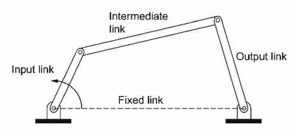

Four bar-shaped members connected to each other in one plane.

Usually:

- 1 fixed link + 3 moving links
- 4 pin joints
- 2 moving pivots + 2 fixed pivots
- 4 turning pairs

- **input link** - usually denoted in the left.
- **output link** - usually denoted in the right.
- **coupler** - intermediate link
- **frame** - fixed link

## Grashof's Law

A four bar mechanism has at least one revolving link **if**
$l_0+l_3 \le l_1+l_2$.

Here: $l_0,l_1,l_2,l_3$ are the length of four bars from shortest to longest. $
$

## Modes of Motions

| Mechanism     | Shortest link | Criteria  |
| ------------- | ------------- | --------- |
| Crank rocker  | Input link    | $s+l<p+q$ |
| Double crank  | Fixed link    | $s+l<p+q$ |
| Double rocker | Coupler link  | $s+l<p+q$ |
| Change point  | Any           | $s+l=p+q$ |
| Triple rocker | Any           | $s+l>p+q$ |

**crank** means a link that makes a full revolution. **rocker** means a link
that doesn't make a full revolution.

### Crank Rocker Mechanism

Shortest link rotates a full revolution. Output link oscillates.

### Double Crank Mechanism

Shortest link is fixed. Both input and output links rotates a full revolution.

### Double Rocker Mechanism

Shortest link make full resolution. Input and output links makes a full
revolution.

## Special Cases

$l_0+l_3 = l_1+l_2$.

| Mechanism                                           | Orientation                            |
| --------------------------------------------------- | -------------------------------------- |
| Parallelogram linkage or anti-parallelogram linkage | Equal links are opposite to each other |
| Deltoid linkage                                     | Equal links are adjacent to each other |

### Parallelogram Linkage

Double crank mechanism. Opposite links are equal and parallel. Angular velocity
of input crank & output crank is same. Orientation of the coupler doesn't change
during the motion.

### Anti-Parallelogram Linkage

Double crank mechanism. Angular velocity of input crank is different to output
crank.

### Deltoid Linkage

- Longest link is fixed  
  Crank rocker mechanism
- Shortest link is fixed  
  Double crank mechanism

## Non-Grashof's Condition

A four bar mechanism with the property **if** $l_0+l_3 \gt l_1+l_2$.

Here: $l_0,l_1,l_2,l_3$ are the length of four bars from shortest to longest. $
$

Three links are in oscillation.
