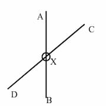
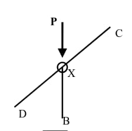
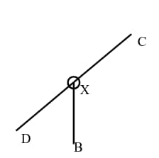
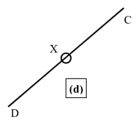
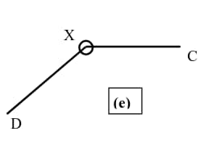

Deviations from the ideal in real trusses.

- Loads are not applied only at joints; hence there is bending in members
- Joints are not perfectly pinned, so moments can be developed at joints

## Method of Joints

### Principle

Since the truss is in equilibrium, each pin joint must also be in equilibrium.

<Note>

2 equilibrium equations can be written at each joint – vertical & horizontal.

</Note>

### Sign convention

Forces acting on each joint is marked. Tensile forces are positive. Compressive
forces are negative.

### Method

- Find external reactions using equilibrium equations for the entire truss.
- Start with a joint with only 2 unknown joint forces.
- Mark the forces (consider all forces are tensile) acting on the joint.
- Find the unknown forces at the selected joint, using 2 equilibrium equations
  for the joint.
- Go to all other joints in turn and find forces in all the members.

### Special cases

| Case                                              | Description                                                |
| ------------------------------------------------- | ---------------------------------------------------------- |
|  | $F_{\text{AX}}=F_{\text{XB}}, F_{\text{DX}}=F_{\text{XC}}$ |
|  | $F_{\text{P}}=F_{\text{XB}}, F_{\text{DX}}=F_{\text{XC}}$  |
|  | $F_{\text{XB}}=0, F_{\text{DX}}=F_{XC}$                    |
|  | $F_{\text{DX}}=F_{\text{XC}}$                              |
|  | $F_{\text{DX}}=F_{\text{XC}}=0$                            |

## Method of Sections

### Principle

Since the truss is in equilibrium, each of its section must be in stable
equilibrium.

### Method

- Decide on which member's internal force must be calculated.
- Cut the truss through **3 or less** members including the target member.
- Internal forces in cut members become external forces. Can be represented as
  tensile forces.
- Use equilibrium equations for RHS or LHS section to find the internal forces.
