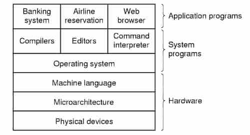

### Program

An ordered sequence of instructions that the hardware can execute.

### Software

The programs that allow users to use a computer system and control its
activities.

### Process

An instance of a running program.

## Categorization of Software

Software can be categorized into system software and application software.

### System software

Any software that satisfies one of the following conditions:

- manages the computer hardware
- can be used to maintain the computer so that it runs efficiently
- helps to do tasks easily and quickly
- helps to create new software
- may not be targeted for end-users

Example: [operating system](/programming-fundamentals/c-book/operating-system)

Systems programming requires a greater degree of hardware awareness compared to
programming application software.

#### Utility software

Performs very specific tasks, usually related to managing computer system
resources.

#### Software development tools

Software that are required to create new software.

Examples:

- Compilers
- Assemblers
- Linkers
- Debuggers

Some operating systems, like Linux, include such software by default.

#### Firmware

System software embedded in a hardware device.

Examples:

- BIOS in personal computers
- controlling software in DVD players

### Application Software

All software except system software. Designed to be used by end-users.

