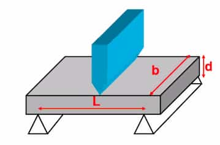

Support the material at 2 ends. Apply pressure perpendicular to the material
until the material fractures. 3-point bending is used here.

$$
\text{MOR}=\frac{3PL}{2bd^2}
$$

Here:

- $L$ - length
- $b$ - width
- $d$ - depth
