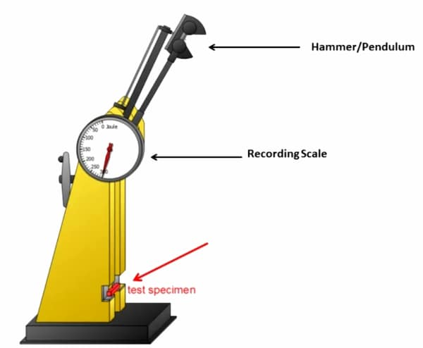
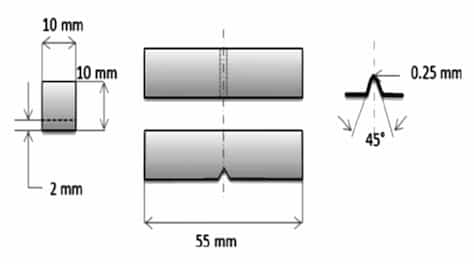

Used to measure [toughness](/s1/properties-of-materials/mechanical-properties/toughness) by measuring energy absorbed during a high-strain-rate fracture.

## Tester

A pendulum hammer is released from height $h_1$ and swings through the specimen. It rises to height $h_2$ after fracture. Energy absorbed:

$$
E = mg(h_1 - h_2)
$$

Higher $E$ means higher toughness.

## Specimen

According to ASTM-E 23.

Specimen is notched to keep the crack straight.

### Loaded state

## Charpy vs Izod

- Charpy  
  Specimen supported at both ends. Hammer strikes the middle, opposite the notch.
- Izod  
  Specimen clamped vertically at 1 end (cantilever). Hammer strikes the free end.

Charpy is more common for metals. Results are not interchangeable.

## Temperature Effect

Absorbed energy decreases as temperature drops for metals that undergo ductile-to-brittle transition. The transition temperature is determined by plotting absorbed energy vs temperature.
