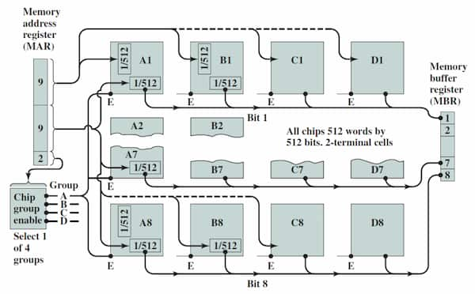

Consists of RAM and secondary memory.

In Von Neumann architecture, both data and instructions are stored in the same memory. In Howard Aiken's architecture, data and instructions are stored in separate memories.

## Memory Cell

Basic element of a semiconductor memory. Carries two stable states: 1 and 0. State can be read or written.

## Memory Chip

Contains a 2D array of memory cells. A memory chip's size is mentioned as "$M \times N\,\text{bit}$". $M$ is the number of words, and $N$ is the size of a word.

### Word

Number of bits written to/read from a chip simultaneously.

## Memory Module

Collection of memory chips.

<figure style="max-width: 700px; margin: 10px auto;">

</figure>

## Memory Types

### RAM

Volatile. High-speed read and write. Can either be dynamic (built using capacitors) or static (built using flip flops).

- SRAM  
  Built using flip flops. Expensive, fast, used for caching.
- DRAM  
  Built using capacitors. Cheap, slow, used for main memory. Needs constant refreshing.

### ROM

Non-volatile memory.

| Memory Type                         | Category    | Erasure                   | Write Mechanism |
| ----------------------------------- | ----------- | ------------------------- | --------------- |
| Read-only memory (ROM)              | Read-only   | Not possible              | Masks           |
| Programmable ROM (PROM)             | Read-only   | Not possible              | Electrically    |
| Erasable PROM (EPROM)               | Read-mostly | UV light, chip-level      | Electrically    |
| Electrically Erasable PROM (EEPROM) | Read-mostly | Electrically, byte-level  | Electrically    |
| Flash memory                        | Read-mostly | Electrically, block-level | Electrically    |

## Designing a Memory Module

For example, to build a $256\text{K}\times 8\,\text{bit}$ module with $256\text{K}\times 1\,\text{bit}$ chips:

- Total number of chips required  
  $(256 \times 2^{10} \times 8) / (256 \times 2^{10} \times 1) = 8$ chips
- Size of address space  
  $256\times 2^{10}$ addresses
- Number of bits for address bus  
  $18$ bits
