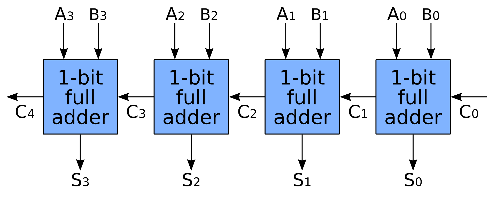
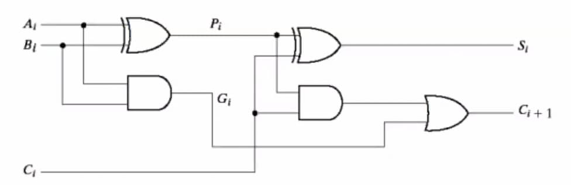

import FullAdder from "./images/full-adder.svg";

## Half Adder

A digital circuit component that adds 2 bits. Outputs 2 bits: sum bit and carry
bit.

$$
S = A \oplus B
\;\;
\text{ and }
\;\;
C = A \cdot B
$$

## Full Adder

A digital circuit component that adds 3 bits. Outputs 2 bits: sum bit and carry
bit. An extension of the half adder where the carry bit of a half adder is input
to another half adder. Built using 2 half adders.

$$
S =
\overline{A}\cdot \overline{B} C_\text{in} +
\overline{A} {B} \overline{C_\text{in}} +
{A} \overline{B}\cdot \overline{C_\text{in}} +
{A} B C_\text{in}
$$

$$
C_\text{out} = \overline{A} B C_\text{in} + A B + A\overline{B}C_\text{in}
$$

<FullAdder />

## Ripple Carry Adder

Made by a chain of full adders joined as mentioned below:

<figure style="max-width: 700px; margin: 10px auto;">

<figcaption>

Image from
[Wikipedia](<https://en.wikipedia.org/wiki/Adder_(electronics)#Ripple-carry_adder>).

</figcaption>
</figure>

Carry output of each FA _ripples_ forward to calculate the output. Delay
increases with number of bits.

## Carry Lookahead Adder

A technique to speedup binary addition by calculating carry bits in parallel. In
a CLA:

- Carry generate - means `C_out` will be created
- Carry propogate - means `C_in` will be sent out as `C_out`

$$
P_i = A_i \oplus B_i
\;\;\;\;
G_i = A_i B_i
$$

$$
S_i = P_i \oplus C_i
\;\;\;\;
C_{i+1} = G_i + P_i C_i
$$

The CLA can be used to create n-bit adders which only have 3 level delay. Faster than RCA.

3 levels of delay:

- Generate & propagate signals
- Carry lookahead (sum-of-products)
