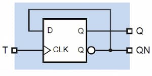
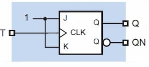
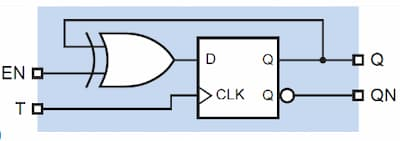
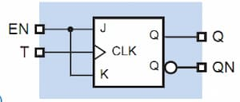

import TFlipFlop from "./images/t-flip-flop.svg";

Aka. toggle flip-flop. Has no inputs. Toggles at a rising (or falling) clock
tick.

<TFlipFlop />

## Characteristics

### Excitation Table

Not required as there are no inputs.

## Implementation

### Using D Flip Flop

### Using JK Flip Flop

### Using D Flip Flop with Enable

### Using JK Flip Flop with Enable

