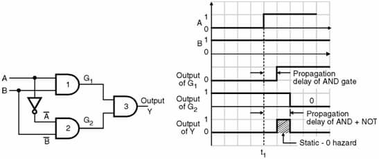
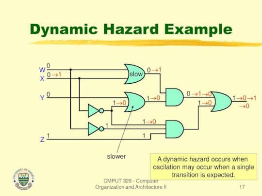

Aka. Glitch. Momentary unwanted switching transient at a logic function's
output. Happens because of unequal propogation delays along different paths in a
combinational circuit.

## Static hazards

Occurs when the output must remain unchanged but switches back and forth due to
a change in input.

When a circuit is implemented as 2-level SOP or POS, the hazard can be detected
using a K-map. There will be a glitch if any two adjacent minterms or maxterms
are not covered by a single product or sum term. Glitches can be resolved by
using redundunt gates.

### Static-0 hazard

Occurs when output must stay at 0 but temporarily switches to a 1 due to a
change in input. Would exist only if a variable and its component are connected
to the same AND gate, either directly or via other gates.

<figure style="max-width: 700px; margin: 10px auto;">

<figcaption>

Image by
[Electronics Tutorial website](https://www.electronics-tutorial.net/finite-state-machines/Hazards/Static-Hazards/)

</figcaption>
</figure>

### Static-1 hazard

Occurs when output must stay at 1 but temporarily switches to a 0 due to a
change in input.

In the example below, The 2
rectangles are enough to include all the HIGH outputs.

Third one is added to avoid
the static-1 hazard.

import Static1Hazard from './images/static-1-hazard.svg';

<Static1Hazard />

## Dynamic hazards

Occurs when input changes, and output must change but temporarily flips between
values. An unwanted change in output. Won't occur in 2 level circuits.
Identification and elimation is hard.

If there are 3 or more paths from an input or its complement to the output, the
circuit has the potential for a dynamic hazard.

<figure style="max-width: 700px; margin: 10px auto;">

<figcaption>

A slide by [Jose Nelson Amaral](https://slideplayer.com/slide/13254593/)

</figcaption>
</figure>

## Elimination

For synchronous circuits: the clock signal can be tuned to eliminate hazards.

For asynchronous circuits: must use the methods mentioned above.
