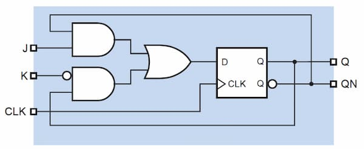

import JKFlipFlop from "./images/jk-flip-flop.svg";

Has 2 inputs: $J$ and $K$, and 1 output: $Q$. Extension of SR flip-flop.
Eliminates the invalid state of SR flip-flop.

<JKFlipFlop />

Widely used in digital systems for counters, shift registers, and other
applications where toggling or controlled state changes are required.

## Characteristics

### Characteristic table

| J   | K   | Operation |
| --- | --- | --------- |
| 0   | 0   | No change |
| 0   | 1   | Reset     |
| 1   | 0   | Set       |
| 1   | 1   | Toggle    |

### Excitation table

| Current State (Q) | Next State (Q+) | J   | K   |
| ----------------- | --------------- | --- | --- |
| 0                 | 0               | 0   | X   |
| 0                 | 1               | 1   | X   |
| 1                 | 0               | X   | 1   |
| 1                 | 1               | X   | 0   |

## Implementation

### Using D Flip Flop

