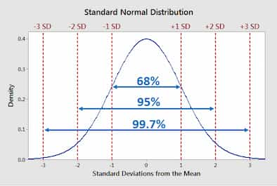

Applies to normal distributions.

- The probability of area between the mean and $\pm 1$ standard deviation is 0.68.
- The probability of area between the mean and $\pm 2$ standard deviations is 0.95.
- The probability of area between the mean and $\pm 3$ standard deviations is 0.997.

<figure style="max-width: 700px; margin: 10px auto;">

<figcaption>

Image by
[Statistics By Jim](https://statisticsbyjim.com/probability/empirical-rule/)

</figcaption>
</figure>

## Chebyshev's Theorem

For any $k\gt 1$, at least $1-\frac{1}{k^2}$ of the values lie within $k\sigma$ of the mean.

$$
P(-k\sigma < X < k\sigma) \le 1-\frac{1}{k^2}
$$
