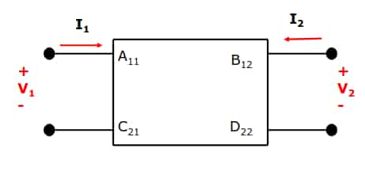

An electrical network with two separate ports for input and output.

### Port

A pair of terminals through which current may enter or leave a network.

## Parameters

### Z Parameters

Denoted by $[z]$. Aka. open-circuit impedance parameters. Measures impedance of the network.

$$
\begin{bmatrix}
V_1 \\
V_2
\end{bmatrix}
=
\begin{bmatrix}
z_{11} & z_{12} \\
z_{21} & z_{22} \\
\end{bmatrix}
\begin{bmatrix}
I_1 \\
I_2
\end{bmatrix}
=
[z]
\begin{bmatrix}
I_1 \\
I_2
\end{bmatrix}
$$

The parameters are found by setting $I_1$ and $I_2$ to $0$ in turn.

### Y Parameters

Denoted by $[y]$. Aka. short-circuit admittance parameters. Measures admittance of the network.

$$
\begin{bmatrix}
I_1 \\
I_2
\end{bmatrix}
=
\begin{bmatrix}
y_{11} & y_{12} \\
y_{21} & y_{22} \\
\end{bmatrix}
\begin{bmatrix}
V_1 \\
V_2
\end{bmatrix}
=
[y]
\begin{bmatrix}
V_1 \\
V_2
\end{bmatrix}
$$

The parameters are found by setting $V_1$ and $V_2$ to $0$ in turn. Same as the inverse of the $[z]$ parameters.

### Transmission Parameters

Denoted by $T$. Aka. ABCD parameters. Measures gain and transfer impedance and transfer admittance.

$$
\begin{bmatrix}
V_1 \\
I_1
\end{bmatrix}
=
\begin{bmatrix}
A & B \\
C & D \\
\end{bmatrix}
\begin{bmatrix}
V_2 \\
-I_2
\end{bmatrix}
$$

Here:

- $A$ - Voltage gain. Open circuit transfer function. Dimensionless.
- $B$ - Transfer impedance. Short circuit transfer impedance.
- $C$ - Transfer admittance. Open circuit transfer admittance.
- $D$ - Current gain. Short circuit current ratio. Dimensionless.

The parameters are found by setting $I_2$ and $V_2$ to $0$ in turn.

#### Reciprocal Network

A network is said to be reciprocal if $AD-BC=1$.

### Hybrid Parameters

$$
\begin{bmatrix}
V_1 \\
I_2
\end{bmatrix}
=
\begin{bmatrix}
h_{11} & h_{12} \\
h_{21} & h_{22} \\
\end{bmatrix}
\begin{bmatrix}
I_1 \\
V_2
\end{bmatrix}
=
[h]
\begin{bmatrix}
I_1 \\
V_2
\end{bmatrix}
$$
