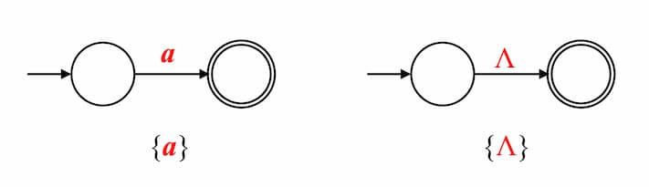
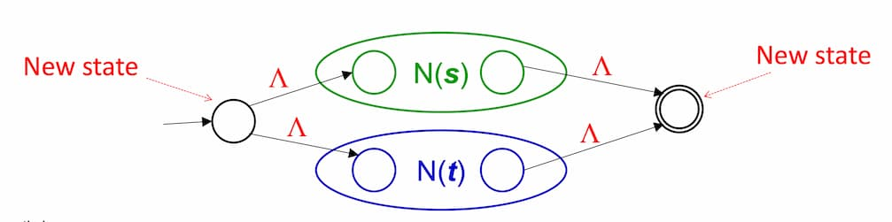
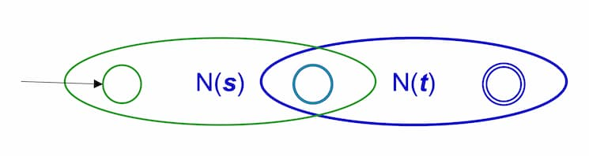
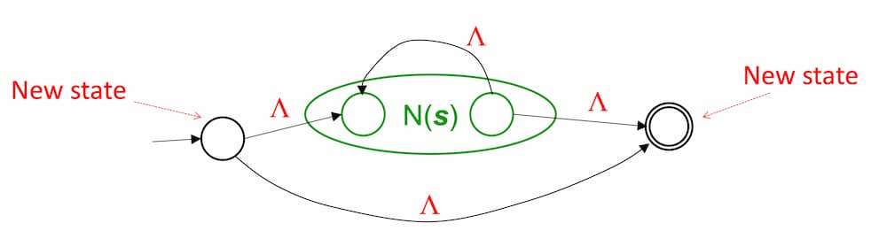

An algorithm for converting a regular expression into an NFA-$\Lambda$. Aka. McNaughton-Yamada-Thompson algorithm.

### Steps

- Break the regular expression into subexpressions
- Construct basic automata
- Combine them using inductive rules

## Basis Automata

For $\set{a}, \set{ \Lambda }$, connect from the starting state to the accepting state for the input.

For $\emptyset$, no diagrams.

## Rules

Suppose $N(s)$ and $N(t)$ are NFA-$\Lambda$ for $s$ and $t$ respectively.

### Union

For strings either $s$ or $t$.

### Concatenation

For strings $st$.

### Kleene Star

For strings $s*$.

## Properties of Thompson Automata

- Exactly one start state
- Exactly one accept state
- No incoming edges to start state
- No outgoing edges from accept state
- Number of states ≤ 2 × (operators + operands)
