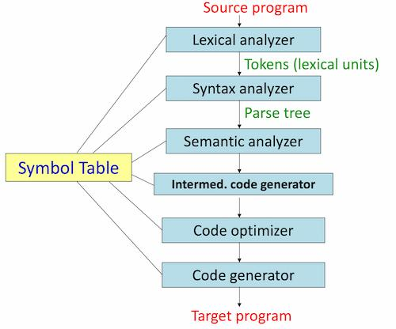

The process of translating a program (source) written in one language into another language (target).

Consists of multiple phases. May involve multiple passes through the source also.

## Phases of Compilation

### Lexical Analysis

Reads the source program character by character from left to right and breaks it down into meaningful units (aka. tokens). Tokens are categorized into identifiers, keywords, numeric constants, operators, and so on.

For example, `pos = init + rate * 60 ;` produces the token stream: `ID(pos) EQ ID(init) PLUS ID(rate) MULT NUM(60) SCOLON`.

Patterns for each token category are specified using regular expressions, and lexical analyzers can be auto-generated by tools like Flex, JFlex, or PLY.

### Syntax Analysis

Aka. parsing or hierarchical analysis. Takes the token stream from the lexical analyzer and groups tokens hierarchically into a parse tree according to the grammar rules of the language. Also verifies that the structure of the program is syntactically valid. Syntactic constructs are recursive in nature and are formalized using context-free grammars (CFGs).

### Semantic Analysis

Checks the parse tree for meaning beyond syntax such as type checking, verifying that variables are declared before use, and ensuring operands are compatible. Some language rules depend on context and cannot be captured by CFGs alone.

### Intermediate Code Generation

An intermediate representation of the source program is generated. It's an internal, lower-level, language-independent form. Allows the compiler to target different target languages.

### Code Optimization

The intermediate code is analyzed and transformed to improve efficiency (reducing execution time and memory use) without changing the program's output.

### Code Generation

Translates the optimized intermediate code into the target language.

### Symbol Table

A shared data structure maintained throughout all phases. Stores information about identifiers (such as their type, scope, and memory location) and is consulted and updated by multiple phases during compilation.
