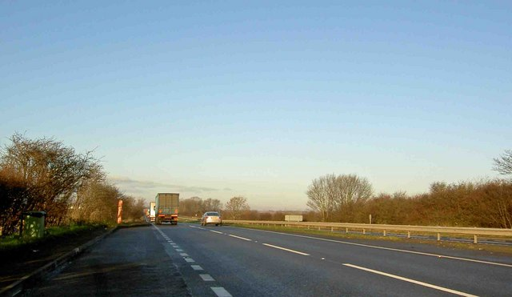

An image is modeled as a function $I(x,y)$ returning the light intensity at position $(x,y)$.

Here:

- $x, y$: spatial coordinates of a point in the image
- $I(x,y)$: light intensity at that point, bounded between a minimum and maximum

## Analog image model

$x, y$ are continuous and range over a bounded region. $I$ is defined at every point of that region and varies continuously.

Properties:

- Infinite spatial resolution  
  A value exists between any two points.
- Continuous intensity  
  No fixed set of allowed values.
- Not directly computable  
  Needs sampling and quantization before a computer can store or process it.

Examples:

- Photographic film
- Image projected on the retina
- Analog video signal

## Digital image model

A digital image is obtained from an analog image by 2 discretization steps.

- Sampling  
  The spatial domain is divided into an $m \times n$ grid. Each cell $(i,j)$ covers a small finite region.
- Quantization  
  The intensity of each cell is mapped to one of $L$ discrete levels.

$I(i,j)$ is the average intensity over cell $(i,j)$ after quantization. The digital image is the matrix of these values. Each element is a pixel.

$$
\begin{bmatrix}
I(0,0) & I(0,1) & \cdots & I(0,n-1) \\
I(1,0) & I(1,1) & \cdots & I(1,n-1) \\
\vdots & \vdots & \ddots & \vdots \\
I(m-1,0) & I(m-1,1) & \cdots & I(m-1,n-1)
\end{bmatrix}
$$

Here:

- $m$: number of rows
- $n$: number of columns
- $i$: row index, $0 \le i \le m-1$
- $j$: column index, $0 \le j \le n-1$
- $L$: number of intensity levels, usually $L = 2^k$ for a bit depth $k$

$m \times n$ is the spatial resolution. $k$ is the bit depth. An 8-bit grayscale image has $L = 256$ levels, $0$ for black and $255$ for white.

Storage size in bits is $m \times n \times k$ for a single channel. A color image repeats this per channel.

In a computer program, an image is simply a matrix of integer values. Image processing means manipulating this matrix.

### Coarse sampling

Large grid cells, so a small $m \times n$ and low spatial resolution. Too sparse to record fine spatial variation.

- Small features fall between sample points and disappear.
- Edges and text look blocky. This is pixelation.

Aliasing happens when the pattern in the scene repeats faster than the grid can follow.

- The sampling rate is the number of samples per unit distance, one per grid cell.
- Capturing a repeating pattern needs at least 2 samples per cycle of that pattern.
- A pattern with more than 1 cycle per 2 cells is undersampled. The samples then fit a different, lower-frequency pattern that was never in the scene.
- On fine repeating textures this false pattern shows up as broad curved bands, called moire fringes.

<figure>

<figcaption>

Left: Original image. Right: Aliasing effect. Image by [Wikipedia](https://en.wikipedia.org/wiki/Aliasing).

</figcaption>

</figure>

### Coarse quantization

Few intensity levels, so a small $L$ and low bit depth. The gaps between levels are large.

- Nearby intensities collapse to the same level.
- A slow gradient becomes a set of flat steps with visible jumps between them. This is banding, also called contouring.
- Most visible in skies and other large smooth regions.

<figure>

<figcaption>

Color banding visible in sky. Image by [By Steve F, CC BY-SA 2.0](https://commons.wikimedia.org/w/index.php?curid=13773379).

</figcaption>

</figure>
