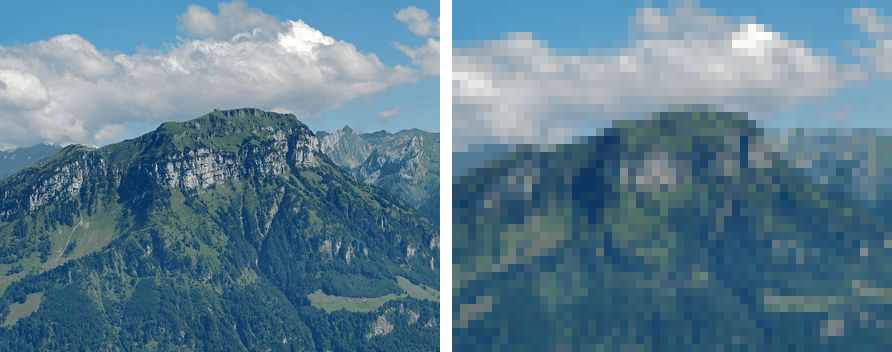
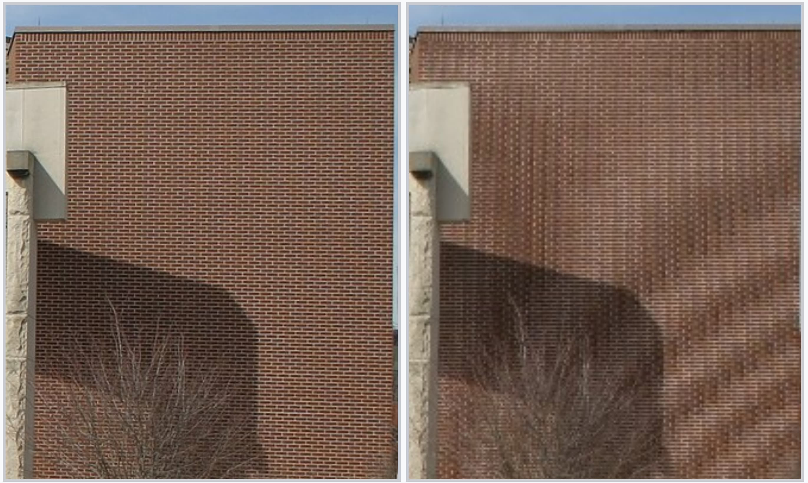
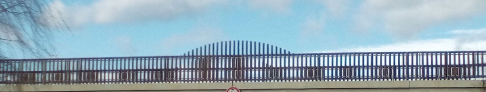

Converting an analog image to digital requires 2 independent choices: sampling and quantization. Both determine the memory required for image storage.

## Sampling

Sampling fixes the spatial resolution. Resolution is the number of samples per unit length, set by the size of the image sensor element.

Coarse sampling has 3 visible effects: loss of information, pixelation, and aliasing.

### Loss of Information

Each cell keeps only one value for the region it covers, so any variation finer than a cell is averaged away and cannot be recovered. Worse with large cells and scenes carrying fine detail.

### Pixelation

Each grid cell becomes one flat square of intensity, so a smooth or diagonal edge is replaced by a staircase of these squares. Most visible on high-contrast boundaries such as text against a plain background. Also called the checkerboard effect or blocking.

<figure>

<figcaption>

Left: Original. Right: Sampled on a grid 8 times coarser, then shown at the original size. Blocky cells replace fine detail.  
Generated from a photo by [Hannes Röst](https://commons.wikimedia.org/wiki/File:Fronalpstock_big.jpg), CC BY-SA 3.0.

</figcaption>

</figure>

### Aliasing

Aliasing happens when a pattern in the scene repeats faster than the sampling grid can follow. The samples then fit a different, lower-frequency pattern that was never in the scene. That false pattern is the alias.

- The sampling rate is the number of samples per unit distance, one per grid cell.
- Capturing a repeating pattern needs at least 2 samples per cycle of that pattern. This is the Nyquist criterion.
- A pattern with more than 1 cycle per 2 cells is undersampled.
- The alias frequency is the true frequency folded about half the sampling rate. A higher scene frequency gives a lower alias frequency.
- On fine repeating textures the alias shows up as broad curved bands, called moire fringes.

Anti-aliasing removes detail finer than the grid can represent, by optical blur or a low-pass filter, before the image is sampled. This costs high-frequency detail, which is less noticeable when sub-sampling.

<figure>

<figcaption>

Left: Original image. Right: Aliasing effect. Image by [Wikipedia](https://en.wikipedia.org/wiki/Aliasing).

</figcaption>

</figure>

<figure>

<figcaption>

Two overlapping railings on a bridge. The beat between the two picket spacings shows up as broad moire bands where the grid is undersampled. Image by [Hidalgo944](https://commons.wikimedia.org/wiki/File:Moire-bridge-picket-fence.jpg), CC BY-SA 4.0.

</figcaption>

</figure>

## Quantization

Quantization fixes the grey-level depth. Grey-level depth is the number of discrete intensity levels, set by the resolution of the analog to digital converter.

Insufficient grey-level depth causes false contouring.

### False Contouring

Across a smooth gradient, a band of neighbouring intensities collapses onto one level and renders as a flat region. The jump to the next level shows up as a sharp edge that is not in the scene. These false edges resemble contour lines, most visible in skies and other large smooth areas.
