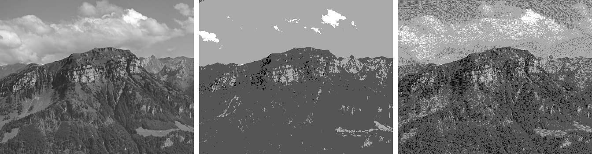

Like dithering, error diffusion trades something else for grey-level depth on a device with few output levels. Each pixel is rounded to the nearest available level. The rounding error, the gap between the original value and the chosen level, is spread over neighbouring pixels not yet processed. Those neighbours are nudged toward the value the current pixel could not hold, so the error cancels over a small region instead of building up.

- Pixels are processed in raster order, left to right and top to bottom.
- The error is split by a fixed kernel whose weights sum to $1$, so total intensity is preserved.
- No sub-pixel division, so spatial resolution is preserved.
- The flat bands of false contouring become high-frequency noise, which the eye tolerates better.

Floyd-Steinberg is the common kernel. With $*$ the current pixel and $-$ the pixels already done, the error is shared as:

$$
\frac{1}{16}
\begin{bmatrix}
- & * & 7 \\
3 & 5 & 1
\end{bmatrix}
$$

Serpentine scanning reverses direction every other row, so the error is not always pushed the same way and directional streaks are avoided.

## Worked Example

Bi-level device with levels $0$ and $255$. One row of 4 pixels, all at value $128$, using 1D diffusion that passes the whole error to the next pixel.

- Pixel 1's $128$ rounds to $0$, error $128$. Pixel 2 becomes $128 + 128 = 256$.
- Pixel 2's $256$ rounds to $255$, error $1$. Pixel 3 becomes $128 + 1 = 129$.
- Pixel 3's $129$ rounds to $255$, error $-126$. Pixel 4 becomes $128 - 126 = 2$.
- Pixel 4's $2$ rounds to $0$.

Output is $0, 255, 255, 0$, mean $127.5$, matching the target $128$ that no single pixel could represent.

<figure>

<figcaption>

Left: Original greyscale. Centre: Reduced to 4 levels, showing false contouring. Right: Reduced to 4 levels with Floyd-Steinberg error diffusion, trading the flat bands for high-frequency noise. Generated from a photo by [Hannes Röst](https://commons.wikimedia.org/wiki/File:Fronalpstock_big.jpg), CC BY-SA 3.0.

</figcaption>

</figure>
