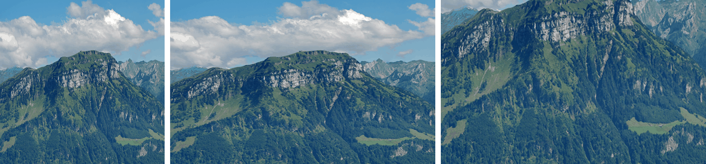

$$
\text{visible image} = f(\text{resolution}, \text{size}, \text{aspect ratio})
$$

- Resolution  
  Dots per unit length.
- Image size  
  Number of dots, or pixels, in the image.
- Aspect ratio  
  Ratio of rows to columns in the pixel grid.
- Pixel aspect ratio  
  Exact shape ($\Delta x : \Delta y$) of a single pixel.

Physical dimensions of the image follow from these, with $R$ defined along the vertical axis so the vertical dot pitch is $1/R$ and the horizontal dot pitch is $\frac{\Delta x}{\Delta y} \cdot \frac{1}{R}$.

$$
\text{width} = N_c \cdot \frac{\Delta x}{\Delta y} \cdot \frac{1}{R}
$$

$$
\text{height} = \frac{N_r}{R}
$$

Here:

- $R$: resolution in dots per unit length
- $N_c$: number of columns
- $N_r$: number of rows
- $\Delta x : \Delta y$: pixel aspect ratio

For square pixels $\Delta x = \Delta y$, so $\text{width} = N_c / R$.

## Changing Geometry

- Changing resolution affects image granularity, potentially causing a checkerboard effect when upscaling
- Changing pixel count affects file size
- Changing physical pixel size or aspect ratio affects object geometry, potentially causing distortion

<Note>

Converting a 4:3 letterbox image for a 16:9 widescreen display requires deciding on the device's pixel aspect ratio, whether to fill the screen, and whether to stretch or crop.

</Note>

<figure>

<figcaption>

Left: Original. Centre: Stretched to a wider frame, distorting object geometry. Right: Cropped to the same frame, keeping geometry but losing content.  
Generated from a photo by [Hannes Röst](https://commons.wikimedia.org/wiki/File:Fronalpstock_big.jpg), CC BY-SA 3.0.

</figcaption>

</figure>
