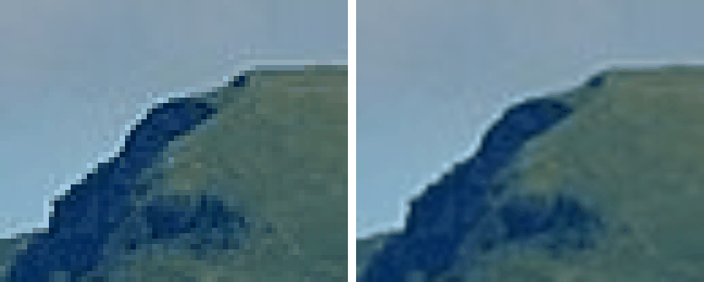

Changing image size parameters requires resampling to create new pixel values: adding pixels when upsampling, replacing pixels when downsampling.

Resampled pixels must:

- Preserve image features, including fine detail
- Reduce noise
- Not introduce artefacts

## Scaling by a Factor of 2

- Enlarge by replicating each row and column
- Reduce by removing every other row and column
- Repeat progressively for larger scaling factors

<Note>

Fine, one-pixel-wide details get lost when downscaling. Upscaling causes a checkerboard effect and aliasing.

</Note>

## Backward Mapping

Each pixel $(x, y)$ in the new grid maps back to a source position.

$$
s_x = \frac{x}{k_x} \qquad s_y = \frac{y}{k_y}
$$

$$
k_x = \frac{\text{new width}}{\text{source width}} \qquad k_y = \frac{\text{new height}}{\text{source height}}
$$

Here:

- $k_x, k_y$: horizontal and vertical scale factors
- $(s_x, s_y)$: source position, generally non-integer

A non-integer $(s_x, s_y)$ falls between source pixels, so no stored value sits there. The output value is built from the 2&times;2 block of source pixels enclosing it, with corners $(\lfloor s_x \rfloor, \lfloor s_y \rfloor)$ and $(\lceil s_x \rceil, \lceil s_y \rceil)$, using either nearest neighbour or interpolation. Corners outside the source are clipped to the border.

## Nearest Neighbour Method

Replaces each new pixel with the value of the closest corner of the enclosing block, using any distance metric.

Preserves most fine detail. Still prone to checkerboard and aliasing effects.

```python
def nearest(src, sw, sh, dw, dh):
    kx, ky = dw / sw, dh / sh
    dst = [[0] * dw for _ in range(dh)]
    for y in range(dh):
        for x in range(dw):
            sx, sy = x / kx, y / ky

            # int(round(sx)) - nearest integer
            # min with sw - 1 to clip to border
            nx = min(sw - 1, int(round(sx)))
            ny = min(sh - 1, int(round(sy)))
            dst[y][x] = src[ny][nx]
    return dst
```

## Interpolation

An alternative to direct scaling: reconstruct, or estimate, the continuous intensity function from discrete samples, then resample it at the required resolution.

- Linear interpolation  
  Assumes the variation between samples is a straight line.
- Cubic interpolation  
  Uses a higher-order polynomial, giving a smoother variation.

In 2-D, these become bilinear and bicubic interpolation.

### Bilinear Interpolation

The new pixel value is a weighted sum of the 4 surrounding source pixels, using the fractional offsets of the source position.

$$
f_x = s_x - \lfloor s_x \rfloor \qquad f_y = s_y - \lfloor s_y \rfloor
$$

$$
\begin{aligned}
v = \ & v_{00}\,(1 - f_x)(1 - f_y) \\
    {}+{} & v_{10}\,f_x\,(1 - f_y) \\
    {}+{} & v_{01}\,(1 - f_x)\,f_y \\
    {}+{} & v_{11}\,f_x\,f_y
\end{aligned}
$$

Here:

- $f_x, f_y$: fractional distances from the top-left neighbour, in $[0, 1)$
- $v_{00}$: top-left neighbour value, at $(\lfloor s_x \rfloor, \lfloor s_y \rfloor)$
- $v_{10}$: top-right, $v_{01}$: bottom-left, $v_{11}$: bottom-right
- $v$: interpolated value, rounded to an integer

Each colour channel is interpolated separately.

- Smoother than nearest neighbour, with no checkerboard effect
- Blurs fine detail, since every output is an average
- Reduces aliasing on downscaling

<figure>



<figcaption>

A small region upscaled 8 times. Left: Nearest neighbour, with blocky cells. Right: Bilinear, smooth but blurred. Generated from a photo by [Hannes Röst](https://commons.wikimedia.org/wiki/File:Fronalpstock_big.jpg), CC BY-SA 3.0.

</figcaption>

</figure>

```python
def clip(v, lo, hi):
    return max(lo, min(hi, v))

def resample(src, sw, sh, dw, dh, mode):
    kx, ky = dw / sw, dh / sh
    dst = [[0] * dw for _ in range(dh)]
    for y in range(dh):
        for x in range(dw):
            sx, sy = x / kx, y / ky

            x0 = clip(int(sx), 0, sw - 1)
            y0 = clip(int(sy), 0, sh - 1)
            x1 = clip(x0 + 1, 0, sw - 1)
            y1 = clip(y0 + 1, 0, sh - 1)

            fx, fy = sx - x0, sy - y0
            dst[y][x] = round(
                src[y0][x0] * (1 - fx) * (1 - fy)
                + src[y0][x1] * fx * (1 - fy)
                + src[y1][x0] * (1 - fx) * fy
                + src[y1][x1] * fx * fy
            )
    return dst
```

For a colour image, run the same kernel on each channel.

## Multi-Scale Pyramids

A series of progressively lower-resolution images derived from one source, each level holding a different band of detail.

### Gaussian Pyramid

The stack of smoothed, downsampled images.

- $G_0$: the original image
- $G_{n+1}$: $G_n$ smoothed with a low-pass kernel, then downsampled by 2

Each level halves the width and height. Smoothing before downsampling removes the high frequencies that would otherwise alias.

### Laplacian Pyramid

The detail lost at each downsampling step, stored as a stack of difference images.

$$
L_n = G_n - U(G_{n+1})
$$

Here:

- $G_n$, $G_{n+1}$: consecutive levels of the Gaussian pyramid above
- $U(G_{n+1})$: $G_{n+1}$ upsampled back to level $n$'s resolution
- $L_n$: band-pass detail at level $n$

$U(G_{n+1})$ is a blurred version of $G_n$, since it was smoothed and downsampled to make $G_{n+1}$ then interpolated back up. Subtracting it leaves only the high-frequency detail that step discarded.

The top level keeps the full Gaussian image $G_N$, not a difference.

Reconstruction runs bottom-up.

$$
G_n = L_n + U(G_{n+1})
$$

Starting from $G_N$, each finer level is recovered exactly.

### Properties

Both pyramids hold about $\tfrac{4}{3}$ as many pixels as the original. As they form a geometric series:

$$
1 + \tfrac14 + \tfrac{1}{16} + \dots = \frac{1}{1 - \tfrac14} = \tfrac43
$$

That is the raw pixel count, not the encoded size. Only the Laplacian pyramid compresses below the original.

- Each $L_n$ is near-zero over smooth regions
- Entropy coding then stores $L_n$ in far fewer bits than $G_n$
- The extra $\tfrac13$ in pixel count is outweighed by the drop in bits per pixel

Uses:

- Progressively encoded compression, coarse levels sent first
- Image blending across scales
- Image indexing and search
