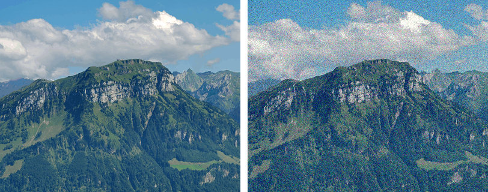
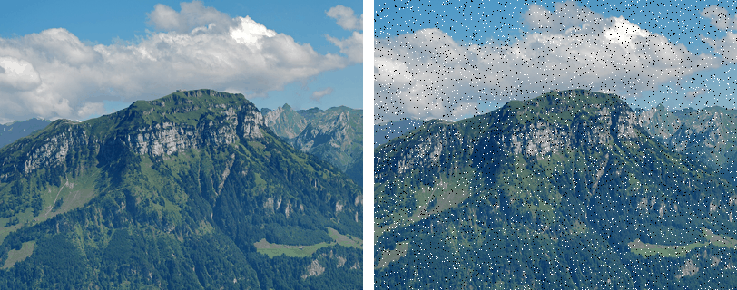

Noise is an unwanted component added to the true image signal during acquisition, storage or transmission, usually random. Structured corruptions introduced by processing, such as compression blocking or aliasing, are normally called artefacts instead.

Often modeled probabilistically, since noise is usually embedded within image detail

<Note>

Total absence of noise can make an image look artificial. Noise is also a natural phenomenon.

</Note>

### Properties

- Locality  
  Noise affects isolated pixels, while image pixels are correlated locally, so noisy pixels stand out by examining local correlation.
- Randomness  
  Noise follows a probability distribution based on its source, allowing its level to be estimated.
- Visibility  
  Noise can be visible, especially in low-contrast images, but is often not perceptible.

## Noise Distribution Models

A noise model gives the probability density $p(z)$ of the noise value $z$ added to a pixel. The shape of $p(z)$ depends on the noise source and decides which filter cancels it.

### Gaussian Noise

Independent noise drawn from a normal distribution is added to every pixel.

$$
p(z) = \frac{1}{\sqrt{2\pi}\,\sigma} \exp\left[-\frac{(z-\mu)^2}{2\sigma^2}\right]
$$

Here:

- $z$: noise value added to a pixel
- $\mu$: mean, taken as $0$ so the noise neither brightens nor darkens on average
- $\sigma$: standard deviation, sets the noise strength

$p(z)$ only gives the probability of each noise value. The amount added to a pixel is an independent random draw following $p(z)$, so the equation fixes the odds, not the outcome.

Unimodal and symmetric about $\mu$. About 68% of values fall within $\pm\sigma$, so most pixels get zero or small noise and large deviations are rare. Arises when many small independent disturbances add up, such as sensor thermal noise. Most common model.

<figure>

<figcaption>

Left: Original. Right: With added Gaussian noise. Every pixel is perturbed by a small zero-mean random amount. Generated from a photo by [Hannes Röst](https://commons.wikimedia.org/wiki/File:Fronalpstock_big.jpg), CC BY-SA 3.0.

</figcaption>

</figure>

### Uniform Noise

Every noise value in a fixed range is equally likely.

$$
p(z) = \begin{cases} \dfrac{1}{b-a} & a \le z \le b \\[2mm] 0 & \text{otherwise} \end{cases}
$$

Here:

- $a$: lower bound of the noise range
- $b$: upper bound of the noise range

Flat with no peak. Mean is $\frac{a+b}{2}$. Hard to estimate because no noise value is more frequent than another. Rarely matches a real source. Quantisation error is close to uniform.

### Salt and Pepper Noise

Aka. impulse noise. A fraction of pixels are forced to the minimum or maximum intensity. The rest are left unchanged.

$$
p(z) = \begin{cases} P_a & z = z_{\min} \\ P_b & z = z_{\max} \\ 1 - P_a - P_b & \text{pixel unchanged} \end{cases}
$$

Here:

- $z_{\min}$, $z_{\max}$: darkest and brightest intensity values
- $P_a$: probability a pixel is set to $z_{\min}$, seen as pepper
- $P_b$: probability a pixel is set to $z_{\max}$, seen as salt

Bi-modal, with spikes only at the two intensity extremes. Corrupted pixels keep none of their original value, so they act as outliers. Caused by bit errors in transmission, dead sensor elements, or ADC faults.

<figure>

<figcaption>

Left: Original. Right: With salt and pepper noise on about 5% of pixels, each forced to pure black or pure white. Generated from a photo by [Hannes Röst](https://commons.wikimedia.org/wiki/File:Fronalpstock_big.jpg), CC BY-SA 3.0.

</figcaption>

</figure>

## Noise Filtering

Noise filtering identifies and reverses the effect of noise on an image, using properties of noise rather than direct observation, since only pixel values after corruption are visible.

## Frame averaging

For a static scene captured over $n$ frames, averaging corresponding pixels across frames cancels the noise contribution while preserving the scene.

$$
\text{Output} = \frac{1}{n}\sum_{i=1}^{n} \text{Frame}_i = F + \frac{1}{n}\sum_{i=1}^{n} N_i
$$

Here:

- $F$: static source scene frame
- $N_i$: noise in frame $i$

<Note>

Only works for a static scene, since the derivation assumes $F$ is constant across all frames.

</Note>

## Mean filter

Averages pixel values within a local neighbourhood. Since correlated image features vary slowly relative to sampling resolution, any local variation is assumed to be noise.

$$
\frac{1}{m}\sum_{i=1}^{m} f_i = P + \frac{1}{m}\sum_{i=1}^{m} N_i
$$

As a convolution kernel:

$$
\frac{1}{9}\begin{bmatrix} 1 & 1 & 1 \\ 1 & 1 & 1 \\ 1 & 1 & 1 \end{bmatrix}
$$

<Note>

Only effective for noise distributions with zero mean. Applying a mean filter to uniform or salt and pepper noise does not cancel it.

</Note>

## Blurring

Local pixel variation is not always caused by noise. Averaging over genuine detail blurs it.

Weighted averages, with more weight on the pivot pixel, reduce blurring:

$$
\frac{1}{10}\begin{bmatrix} 1 & 1 & 1 \\ 1 & 2 & 1 \\ 1 & 1 & 1 \end{bmatrix}
\qquad
\frac{1}{16}\begin{bmatrix} 1 & 2 & 1 \\ 2 & 4 & 2 \\ 1 & 2 & 1 \end{bmatrix}
$$

### Gaussian filter

Weights arranged according to a 2-D Gaussian surface.

$$
h(x,y) = \exp\left[-\frac{x^2+y^2}{2\sigma^2}\right]
$$

### Conditional averaging

Reduces blurring by only replacing pixels where the local variation is likely to be noise.

- Threshold averaging  
  Replace the pixel with the local mean $m_l(x,y)$ only if the difference from the pivot is smaller than a threshold $T$.

$$
g(x,y) = \begin{cases} m_l(x,y) & \text{if } |f(x,y) - m_l(x,y)| < T \\ f(x,y) & \text{otherwise} \end{cases}
$$

- $k$-closest averaging  
  Select $k \le M$ pixels with values closest to the pivot before averaging, avoiding outliers that represent real image features. Requires sorting pixel values.

## Median filter

Replaces the pivot pixel with the median value of its neighbourhood.

- Preserves edges better than mean filtering
- Well suited to salt and pepper noise, since outlier values get discarded rather than averaged in
